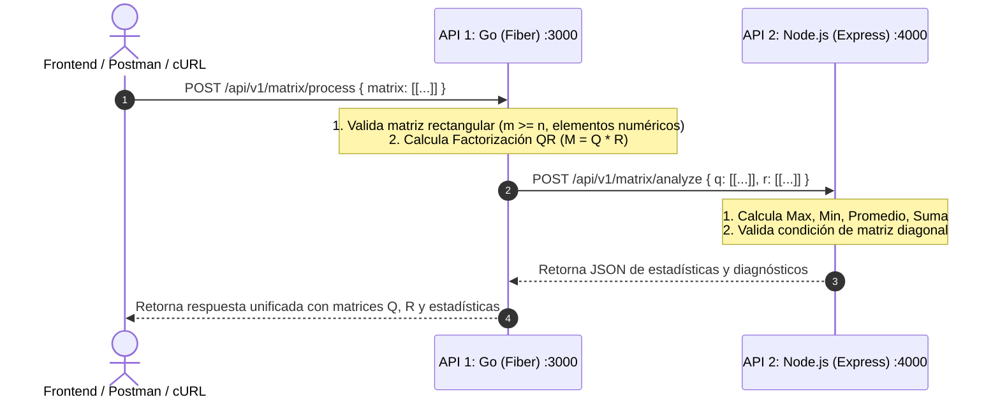

# Spec 01: Reto Interseguro - Factorización QR y Estadísticas Matriciales

## 1. Contratos de Comunicación y Flujo

## 2. Definición Matemática de Factorización QR
Dada una matriz rectangular $A \in \mathbb{R}^{m \times n}$ con $m \ge n$:
- $Q \in \mathbb{R}^{m \times n}$ con columnas ortonormales ($Q^T Q = I_n$).
- $R \in \mathbb{R}^{n \times n}$ es una matriz triangular superior invertible.
- Implementación: Gram-Schmidt Modificado (MGS) o Reflexiones de Householder para máxima estabilidad numérica.

## 3. Lógica de Estadísticas en Node.js
Dadas $Q$ y $R$:
- **Valores Consolidados**:
  - `max`: $\max(v \in Q \cup R)$
  - `min`: $\min(v \in Q \cup R)$
  - `sum`: $\sum v$
  - `average`: $\frac{\text{sum}}{\text{total elements}}$
- **Matriz Diagonal**:
  - Una matriz $M_{p \times p}$ es diagonal si $\forall i \neq j, |M_{i,j}| < \epsilon$ (con $\epsilon = 10^{-6}$).
  - Si la matriz no es cuadrada, no es diagonal por definición.
