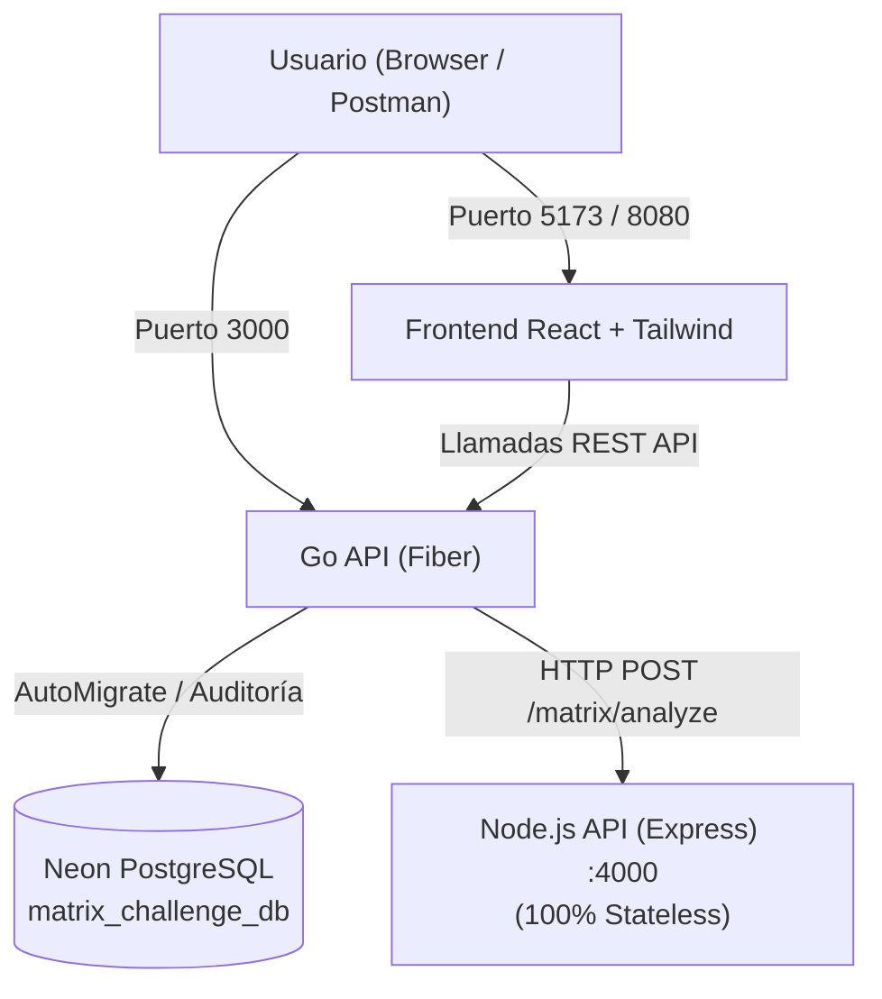

# Arquitectura del Sistema - Documentación Wiki

## 1. Topología de Microservicios

## 2. Contratos de Comunicación
- **Input a Go**: `POST /api/v1/matrix/process` con payload `{"matrix": [[...]]}` y cabecera opcional `Authorization: Bearer <token>`.
- **Go hacia Node**: `POST /api/v1/matrix/analyze` con payload `{"q": [[...]], "r": [[...]]}`.
- **Node hacia Go**: JSON con `stats` (max, min, average, sum, total_elements) y `diagonal_check` (is_q_diagonal, is_r_diagonal, is_any_diagonal).
- **Persistencia**: Registro automático en `matrix_operations` y `matrix_analytics` con FK hacia `users(id)` si se incluye token JWT.

## 3. Principio de Idempotencia en el Arranque
El servicio de Go ejecuta en cada arranque la función `AutoMigrate`:
- Tablas creadas con `CREATE TABLE IF NOT EXISTS`.
- Índices con `CREATE INDEX IF NOT EXISTS`.
- Semillas con `ON CONFLICT (id) DO NOTHING` y `ON CONFLICT (username) DO NOTHING`.
- Cero intervención manual o scripts externos para inicializar la base de datos.
