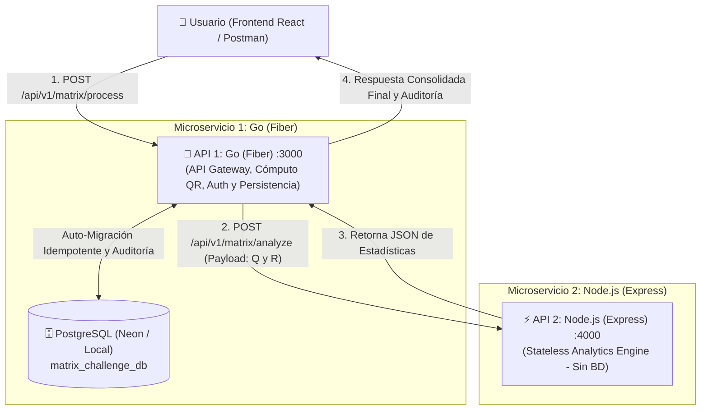

# Reto Técnico Interseguro - Factorización QR & Analítica Distribuida

Solución de arquitectura orientada a microservicios distribuidos para el procesamiento matemático y análisis estadístico de matrices rectangulares y cuadradas utilizando **Go (Fiber)**, **Node.js (Express)**, **React 18 (Vite + Tailwind CSS)**, **PostgreSQL (Neon Cloud)** y **Docker**.

---

## 🏛️ Arquitectura del Sistema (Hexagonal + Vertical Slices)

El proyecto implementa el patrón **Hexagonal Architecture + Vertical Slices (Screaming Architecture)** con separación estricta de responsabilidades:



---

## 🎯 Responsabilidades por Microservicio

1. **Frontend (`services/frontend`) [React 18 + Vite + Tailwind CSS + Lucide]**:
   * **Bloque 1 (Auth Wall):** Pantalla obligatoria de inicio de sesión con JWT y registro dinámico de evaluadores.
   * **Bloque 2 (Matrix Input Panel):** Cuadrícula dinámica interactiva ($m \times n$), plantillas rápidas y selector de catálogo desde PostgreSQL.
   * **Bloque 3 (Visualizador de Matrices):** Renderizado sin scroll de Matriz Original $A$, Matriz Ortogonal $Q$ y Matriz Triangular Superior $R$ con tiempo de ejecución (`execution_time_ms`).
   * **Bloque 4 (Tarjetas de Analítica):** Máximo, Mínimo, Promedio, Suma Total, Badge de Matriz Diagonal y Pestaña de Historial con aislamiento por usuario.

2. **API 1: Go (`services/go-api`) [Fiber v2] [Puerto 3000]**:
   * **Cómputo QR en Memoria:** Factorización $M = Q \times R$ mediante Gram-Schmidt Modificado (MGS) con tolerancia $\epsilon = 10^{-9}$ para matrices cuadradas y rectangulares ($m \ge n$).
   * **API Gateway & Orquestación:** Envía las matrices $Q$ y $R$ por HTTP POST a Node.js y consolida la respuesta final.
   * **Persistencia & Auditoría:** Único servicio conectado a PostgreSQL. Registra las operaciones en `matrix_operations` y `matrix_analytics` asociadas al `user_id` autenticado.
   * **Auto-Migración Idempotente:** En cada arranque verifica y crea automáticamente tablas, índices y semillas si no existen.

3. **API 2: Node.js (`services/node-api`) [Express + pnpm] [Puerto 4000]**:
   * **100% Stateless:** No requiere base de datos ni credenciales.
   * **Motor Estadístico:** Calcula en memoria: Valor Máximo, Valor Mínimo, Promedio, Suma Total y Verificación de Matriz Diagonal ($\epsilon = 10^{-6}$).

---

## 🛠️ Prerrequisitos

* **Go**: Versión `1.22` o superior.
* **Node.js**: Versión `20.x` o superior.
* **pnpm**: Gestor de paquetes rápido (`npm install -g pnpm`).
* **PostgreSQL**: Base de datos local o instancia en la nube (ej. Neon Cloud).

---

## 🚀 Guía de Inicio Rápido (Clonar y Ejecutar)

### 1. Clonar el Repositorio
```bash
git clone https://github.com/coder-WillGia/pruebaGoNode.git
cd pruebaGoNode
```

---

### 2. Configurar Variables de Entorno (`.env`)

Cada microservicio cuenta con su respectiva plantilla `.env.example`. Copia los archivos de configuración:

#### A. Backend Go (`services/go-api`)
```powershell
cd services/go-api
Copy-Item .env.example .env
```
> Edita `services/go-api/.env` y ajusta `DATABASE_URL` con tu cadena de conexión a PostgreSQL.

#### B. Backend Node.js (`services/node-api`)
```powershell
cd ../node-api
Copy-Item .env.example .env
pnpm install
```

#### C. Frontend React (`services/frontend`)
```powershell
cd ../frontend
Copy-Item .env.example .env
pnpm install
```

---

### 3. Ejecutar los Microservicios Localmente

Abre 3 terminales y ejecuta cada servicio:

#### Terminal 1: Iniciar Go API (Puerto 3000)
```powershell
cd services/go-api
.\dev.ps1
# (O alternativamente: go run cmd/api/main.go)
```
> **Nota de Auto-Migración:** Al arrancar, Go creará automáticamente todas las tablas (`users`, `matrix_inputs`, `matrix_operations`, `matrix_analytics`), índices y los datos iniciales sin requerir scripts SQL manuales.

#### Terminal 2: Iniciar Node.js API (Puerto 4000)
```powershell
cd services/node-api
pnpm run dev
```

#### Terminal 3: Iniciar Frontend React (Puerto 5173)
```powershell
cd services/frontend
pnpm run dev
```

Abre tu navegador en: **`http://localhost:5173`**

---

## 🔑 Credenciales de Acceso de Prueba

El sistema cuenta con un usuario administrador/evaluador precargado por el seeder automático:

* **Usuario:** `evaluador_interseguro`
* **Contraseña:** `interseguro2026`

*(También puedes registrar un usuario nuevo al instante haciendo clic en **"Crear cuenta"** desde la pantalla de bienvenida).*

---

## 🐳 Despliegue con Docker (Contenedores Individuales)

Cada microservicio cuenta con su propio `Dockerfile` Multi-Stage optimizado con Alpine Linux:

```bash
# 1. Crear red interna de Docker
docker network create interseguro-network

# 2. Compilar y levantar Node.js API (:4000)
cd services/node-api
docker build -t interseguro-node-api .
docker run -d --name node-api --network interseguro-network -p 4000:4000 interseguro-node-api

# 3. Compilar y levantar Go API (:3000)
cd ../go-api
docker build -t interseguro-go-api .
docker run -d --name go-api --network interseguro-network -p 3000:3000 \
  --env-file .env \
  interseguro-go-api

# 4. Compilar y levantar Frontend React (:8080)
cd ../frontend
docker build -t interseguro-frontend .
docker run -d --name frontend --network interseguro-network -p 8080:80 interseguro-frontend
```

---

## 📬 Colección de Postman

Importa el archivo [`postman/Interseguro_Challenge.postman_collection.json`](./postman/Interseguro_Challenge.postman_collection.json) directamente en Postman para probar todos los endpoints:

| Método | Endpoint | Microservicio | Descripción |
| :--- | :--- | :--- | :--- |
| `POST` | `/api/v1/auth/login` | Go (:3000) | Autenticación y generación de Bearer Token JWT |
| `POST` | `/api/v1/auth/register` | Go (:3000) | Registro de nuevos usuarios con contraseña encriptada (bcrypt) |
| `POST` | `/api/v1/matrix/process` | Go (:3000) | **Principal:** Calcula Factorización QR, llama a Node y registra auditoría |
| `POST` | `/api/v1/matrix/process/:id`| Go (:3000) | Procesa una matriz existente en el catálogo de BD por UUID |
| `GET` | `/api/v1/matrices` | Go (:3000) | Lista las matrices guardadas en el catálogo |
| `GET` | `/api/v1/matrix/history` | Go (:3000) | Historial de auditoría filtrado por el usuario autenticado |
| `POST` | `/api/v1/matrix/analyze` | Node (:4000) | Endpoint analítico directo en Node.js (Stateless) |
| `GET` | `/health` | Go & Node | Health check de cada servicio |

---

## 📐 Justificación Matemática: Factorización QR

La **Factorización QR** descompone una matriz real $A \in \mathbb{R}^{m \times n}$ con $m \ge n$ en el producto:

$$A = Q \times R$$

Donde:
* **$Q \in \mathbb{R}^{m \times n}$**: Es una matriz con columnas ortonormales ($Q^T Q = I_n$).
* **$R \in \mathbb{R}^{n \times n}$**: Es una matriz triangular superior invertible.

### Algoritmo: Gram-Schmidt Modificado (MGS)
Se seleccionó la variante **Gram-Schmidt Modificado** debido a su superior estabilidad numérica frente a la versión clásica, mitigando errores por cancelación catastrófica de punto flotante en matrices mal condicionadas mediante proyecciones ortogonales sucesivas:

$$\mathbf{v}_k^{(j)} = \mathbf{v}_k^{(j-1)} - \left( \mathbf{q}_j^T \mathbf{v}_k^{(j-1)} \right) \mathbf{q}_j \quad \text{para } k = j+1, \dots, n$$

---

## 📂 Estructura del Repositorio

```text
pruebaGoNode/
├── 00-SPECS/                       # Especificaciones técnicas y changelogs SDD
│   ├── 01-matrix-challenge-spec.md
│   └── 02-implementation-changelog.md
├── 01-TOOLS/                       # Scripts de prueba y validación de pipeline
│   └── test-matrix-pipeline/
├── 02-DOCS/                        # Documentación wiki de arquitectura
│   └── wiki/
│       └── architecture.md
├── postman/                        # Colección completa de Postman
│   └── Interseguro_Challenge.postman_collection.json
├── services/
│   ├── go-api/                     # API 1: Go (Fiber) - Factorización QR & Gateway
│   │   ├── cmd/api/main.go         # Punto de entrada principal
│   │   ├── internal/
│   │   │   ├── matrix_processing/  # Core matemático QR & Orquestación
│   │   │   ├── matrix_catalog/     # Gestión del catálogo en BD
│   │   │   ├── auth/               # Autenticación JWT y Bcrypt
│   │   │   └── shared/             # Configuración, AutoMigrate y respuestas
│   │   ├── Dockerfile              # Multi-Stage Alpine
│   │   └── dev.ps1                 # Script de arranque rápido
│   │
│   ├── node-api/                   # API 2: Node.js (Express) - Motor Analítico
│   │   ├── src/
│   │   │   ├── modules/matrix-analytics/ # Max, Min, Promedio, Suma, Diagonal
│   │   │   └── shared/             # Configuración y manejo de errores
│   │   ├── Dockerfile              # Multi-Stage Alpine (pnpm)
│   │   └── package.json
│   │
│   └── frontend/                   # Frontend SPA: React 18 + Tailwind CSS
│       ├── src/
│       │   ├── components/         # LoginScreen, Navbar, MatrixInput, Visualizer, Analytics
│       │   └── App.jsx
│       └── Dockerfile              # Nginx Alpine
└── README.md
```
